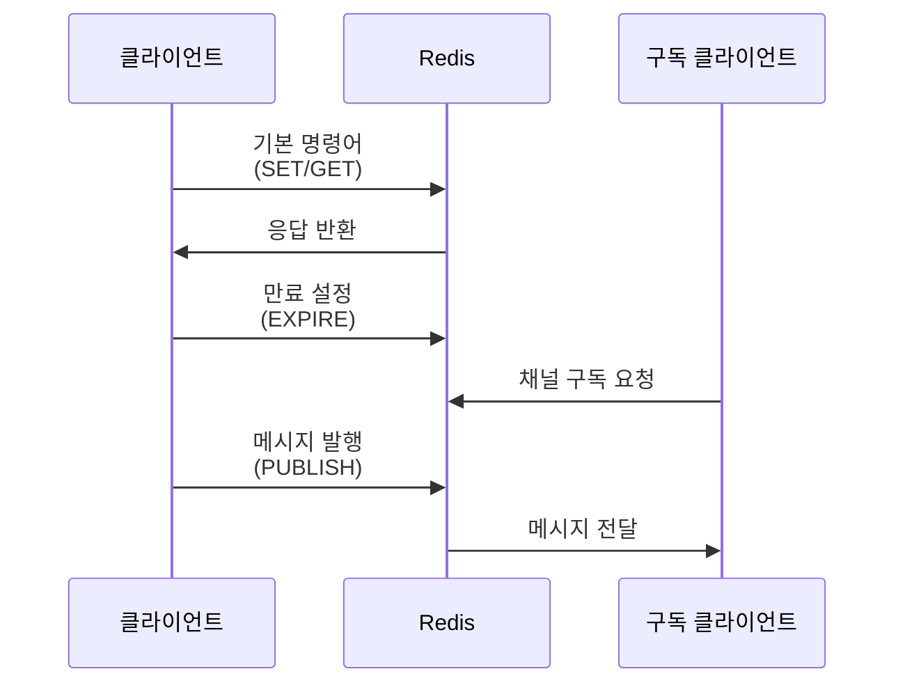

# Redis CLI Practice

## Source Structure

```
/redis-cli-practice
  ├── examples/
  │   ├── basic-commands.md     # 기본 명령어
  │   ├── data-structures.md    # 데이터 구조 명령어
  │   ├── pubsub-example.md     # 구독/발행 예제
  │   ├── expiration.md         # 만료 설정 예제
  │   └── session-handling.md   # 세션 처리 예제
  ├── scripts/
  │   ├── benchmark.sh          # 성능 테스트 스크립트
  │   └── load-test.sh          # 부하 테스트 스크립트
  └── README.md                 # 실습 가이드
```

## Sequence Diagram




## 2단계: "Redis 명령어 실습" - CLI 명령어 실행
1. Redis CLI를 실행하여 Redis 서버에 접속합니다

```
bash
docker exec -it redis redis-cli -a mypassword

```

2. 다양한 Redis 명령어를 실습합니다 (예: SET, GET, DEL 등).
3. 발행/구독 패턴은 두 개의 터미널 창에서 각각 Redis CLI를 실행하여 테스트합니다.