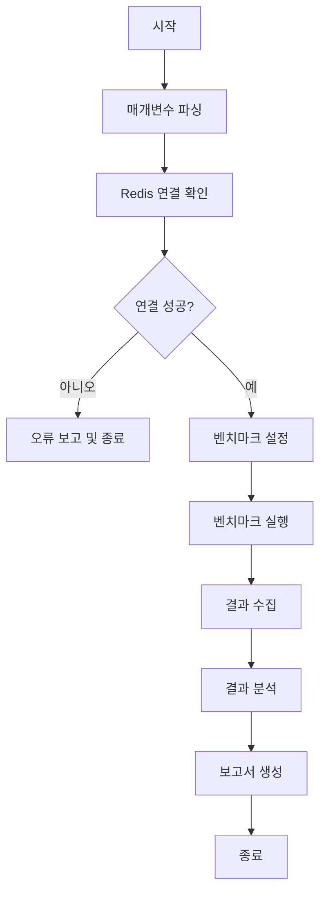

# 성능 테스트 스크립트 (benchmark.sh)

## 개요
이 스크립트는 Redis 서버의 성능을 측정하기 위한 도구입니다. 다양한 명령어와 설정에 대한 성능 메트릭을 수집합니다.

## 사용법
```bash
./scripts/benchmark.sh [options]
```

## 옵션
- `-h` : 호스트 지정 (기본값: localhost)
- `-p` : 포트 지정 (기본값: 6379)
- `-c` : 동시 연결 수 (기본값: 50)
- `-n` : 총 요청 수 (기본값: 100000)
- `-d` : 데이터 크기 (바이트) (기본값: 3)
- `-t` : 테스트할 명령어 (기본값: set,get)

## 테스트 흐름도



## 예제 명령어
```bash
# 기본 설정으로 실행
./scripts/benchmark.sh

# 커스텀 설정으로 실행
./scripts/benchmark.sh -h redis.example.com -p 6380 -c 100 -n 500000 -d 1024 -t set,get,hset,hget

# 특정 명령어만 테스트
./scripts/benchmark.sh -t set,get,lpush,lpop
```

## 출력 예시
```
====== SET ======
  100000 requests completed in 1.89 seconds
  50 parallel clients
  3 bytes payload
  keep alive: 1
  host: localhost
  port: 6379
  
99.99% <= 1 milliseconds
100.00% <= 1 milliseconds
52910.05 requests per second

====== GET ======
  100000 requests completed in 1.77 seconds
  50 parallel clients
  3 bytes payload
  keep alive: 1
  host: localhost
  port: 6379
  
99.98% <= 1 milliseconds
100.00% <= 1 milliseconds
56497.18 requests per second
```

## 주의사항
- 프로덕션 환경에서 실행 시 서버 부하에 주의하세요
- 충분한 메모리가 확보된 상태에서 실행하세요
- 실제 워크로드와 유사한 설정으로 테스트하는 것이 좋습니다

## 스크립트 사용법 정리
### 이 스크립트는 Redis 서버의 성능을 측정하기 위한 실용적인 도구입니다.
### 스크립트의 주요 특징:

1. 다양한 옵션 지원:

- 호스트, 포트, 클라이언트 수, 요청 수, 데이터 크기 등 다양한 매개변수 설정 가능
- 특정 Redis 명령어들에 대한 성능 테스트 수행 가능


2. 기능:

- Redis 서버 연결 확인
- redis-benchmark 유틸리티를 사용한 성능 테스트 실행
- 결과를 CSV 파일로 저장하는 옵션 제공
- TLS 연결 지원
- Redis 인증 지원


3. 출력 정보:

- 각 명령어별 성능 메트릭(초당 요청 수, 응답 시간 분포)
- 테스트 실행 시간
- 상세 모드에서는 Redis 서버 정보도 표시

4. 스크립트 실행 방법
```bash

# 기본 설정으로 실행
chmod +x benchmark.sh
./benchmark.sh

# 커스텀 설정으로 실행
./benchmark.sh -h redis.example.com -p 6380 -c 100 -n 500000 -d 1024 -t set,get,hset,hget

# 결과를 CSV로 저장
./benchmark.sh -t set,get,lpush,lpop -csv results.csv

# 특정 명령어만 테스트
./benchmark.sh -t set,get,lpush,lpop  

```