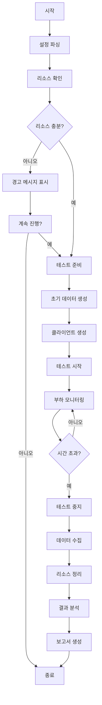

# 부하 테스트 스크립트 (load-test.sh)

## 개요
이 스크립트는 Redis 서버에 높은 부하를 발생시켜 안정성과 성능 저하 여부를 테스트합니다. 대규모 동시 연결 및 지속적인 데이터 요청을 통해 시스템의 한계를 측정합니다.

## 사용법
```bash
./scripts/load-test.sh [options]
```

## 옵션
- `-h` : 호스트 지정 (기본값: localhost)
- `-p` : 포트 지정 (기본값: 6379)
- `-c` : 동시 클라이언트 수 (기본값: 1000)
- `-n` : 클라이언트당 요청 수 (기본값: 10000)
- `-d` : 데이터 크기 (KB) (기본값: 10)
- `-t` : 테스트 지속 시간 (초) (기본값: 60)
- `-r` : 요청 비율 (RPS) (기본값: 0, 무제한)
- `-m` : 테스트 모드 (기본값: mixed)
  - `read`: 읽기 전용 테스트
  - `write`: 쓰기 전용 테스트
  - `mixed`: 읽기/쓰기 혼합 테스트 (70:30 비율)

## 테스트 흐름도



## 예제 명령어
```bash
# 기본 설정으로 실행
./scripts/load-test.sh

# 높은 부하 테스트
./scripts/load-test.sh -c 5000 -n 100000 -d 50 -t 300

# 읽기 전용 테스트 (초당 10,000 요청으로 제한)
./scripts/load-test.sh -m read -r 10000 -t 120

# 쓰기 전용 테스트 (대용량 데이터)
./scripts/load-test.sh -m write -d 100 -c 500 -t 180
```

## 출력 예시
```
====== LOAD TEST START ======
설정:
- 호스트: localhost:6379
- 클라이언트 수: 1000
- 요청 수/클라이언트: 10000
- 데이터 크기: 10KB
- 테스트 시간: 60초
- 모드: mixed (읽기:쓰기 = 70:30)

진행 중... [####################] 100%

====== 결과 요약 ======
- 총 처리된 요청: 10,000,000
- 평균 응답 시간: 2.3ms
- 최대 응답 시간: 45ms
- 처리량: 166,666 RPS
- 실패한 요청: 52 (0.00052%)
- 메모리 사용량 증가: 1.2GB

== 성능 저하 분석 ==
- 45초 후 응답 시간 10% 증가
- 55초 후 응답 시간 25% 증가
- 메모리 프래그먼테이션 비율: 1.15

== 권장 사항 ==
- maxclients 설정 증가 고려
- 메모리 확보 필요
- 연결 풀링 개선 필요
```

## 주의사항
- 이 스크립트는 서버에 상당한 부하를 발생시킵니다
- 프로덕션 환경에서는 주의하여 사용하세요
- 필요한 경우 점진적으로 부하를 증가시키는 것이 좋습니다
- 테스트 중 시스템 메트릭을 모니터링하세요 (CPU, 메모리, 네트워크)
