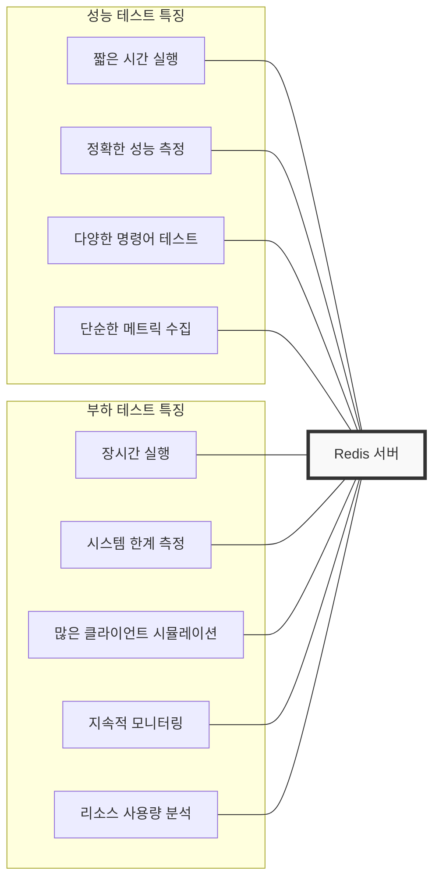

# Redis 테스트 스크립트 흐름도 비교

## 개요
이 문서는 Redis CLI 프로젝트에서 사용되는 두 가지 주요 테스트 스크립트(성능 테스트와 부하 테스트)의 흐름과 차이점을 비교합니다.

## 전체 테스트 프로세스 비교

```mermaid
flowchart TB
    subgraph "성능 테스트 (benchmark.sh)"
        A1[시작] --> B1[매개변수 파싱]
        B1 --> C1[Redis 연결 확인]
        C1 --> D1[벤치마크 설정]
        D1 --> E1[벤치마크 실행]
        E1 --> F1[결과 수집]
        F1 --> G1[결과 분석]
        G1 --> H1[보고서 생성]
        H1 --> I1[종료]
    end

    subgraph "부하 테스트 (load-test.sh)"
        A2[시작] --> B2[설정 파싱]
        B2 --> C2[리소스 확인]
        C2 --> D2[초기 데이터 생성]
        D2 --> E2[클라이언트 생성]
        E2 --> F2[테스트 시작]
        F2 --> G2[부하 모니터링]
        G2 --> H2[테스트 중지]
        H2 --> I2[데이터 수집]
        I2 --> J2[리소스 정리]
        J2 --> K2[결과 분석]
        K2 --> L2[보고서 생성]
        L2 --> M2[종료]
    end

    style A1 fill:#f9d5e5,stroke:#333,stroke-width:2px
    style I1 fill:#f9d5e5,stroke:#333,stroke-width:2px
    style A2 fill:#d5e8f9,stroke:#333,stroke-width:2px
    style M2 fill:#d5e8f9,stroke:#333,stroke-width:2px
```

## 주요 차이점 비교

## 사용 시나리오 비교

| 성능 테스트 (benchmark.sh) | 부하 테스트 (load-test.sh) |
|---------------------------|---------------------------|
| 개발 단계에서 성능 확인 | 프로덕션 배포 전 안정성 검증 |
| 특정 명령어의 응답 시간 측정 | 시스템 장애 지점 파악 |
| 설정 변경 효과 측정 | 스케일링 요구사항 파악 |
| 빠른 피드백 필요 시 | 장기적 신뢰성 테스트 |
| 다양한 명령어 비교 | 실제 사용 패턴 시뮬레이션 |

## 결론
두 테스트 스크립트는 상호 보완적인 목적으로 사용됩니다:
- **benchmark.sh**는 빠른 성능 측정과 명령어별 반응 시간을 파악하는 데 적합합니다.
- **load-test.sh**는 시스템의 안정성과 한계점을 발견하는 데 최적화되어 있습니다.

효과적인 Redis 시스템 테스트를 위해서는 두 스크립트를 모두 활용하는 것이 권장됩니다.
